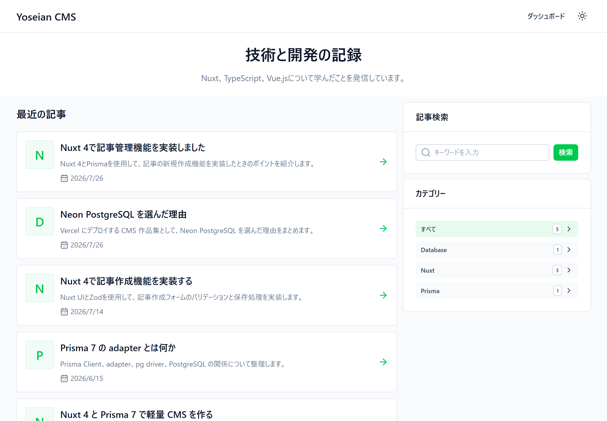
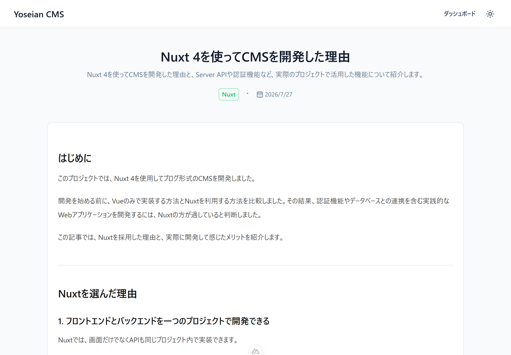
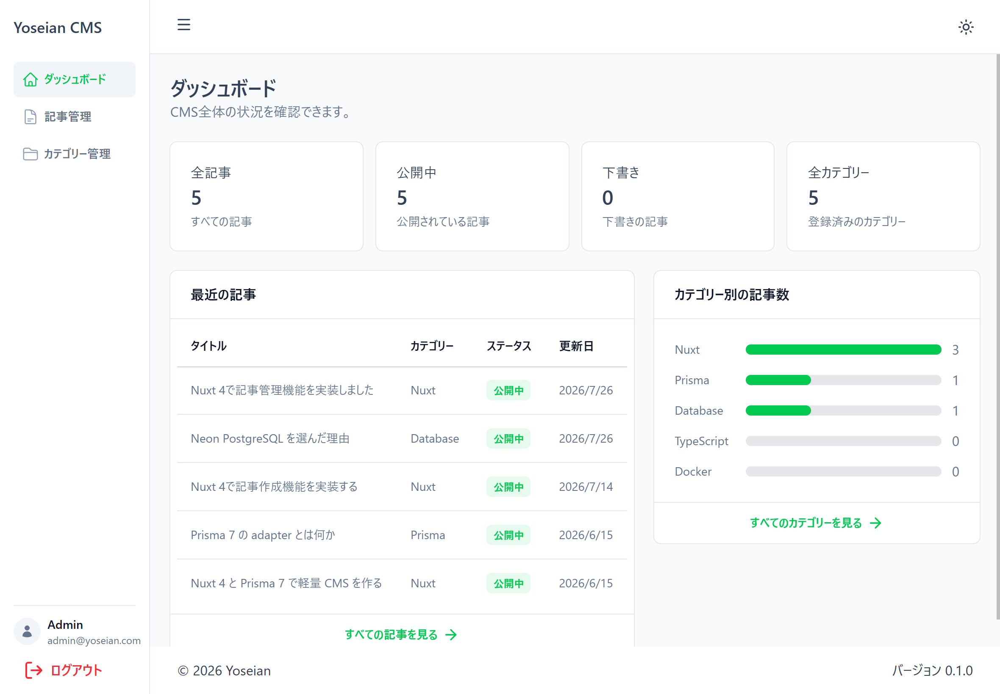
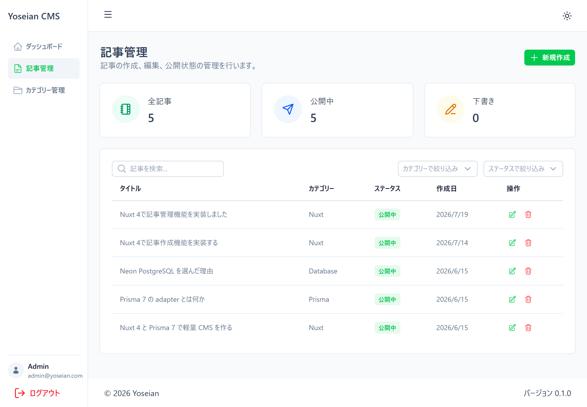
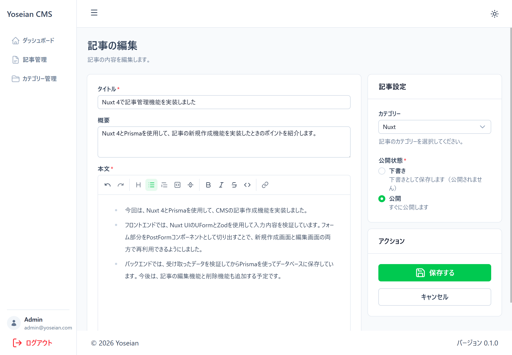

# Yoseian CMS

Nuxt 4、TypeScript、Prisma、PostgreSQL を使用して開発した、ブログ形式の CMS アプリケーションです。

公開サイトでの記事閲覧に加え、管理画面から記事やカテゴリーの作成・編集・削除、公開状態の管理を行えます。

画面実装だけでなく、認証、API、データベース、入力検証、エラー処理、レスポンシブ対応、デプロイまで含めた、実践的な CMS 開発を目的として制作しました。

## Demo

* 公開サイト: https://yoseian.vercel.app
* GitHub: https://github.com/yoseian-dev/cms-portfolio

## Screenshots

```text
docs/
└── images/
    ├── public-home.png
    ├── post-detail.png
    ├── admin-dashboard.png
    ├── admin-posts.png
    └── post-editor.png
```

### 公開トップページ



### 記事詳細ページ



### 管理ダッシュボード



### 記事管理



### 記事編集



## Features

### 公開サイト

* 公開済み記事の一覧表示
* 記事タイトルと概要によるキーワード検索
* カテゴリーによる記事絞り込み
* ページネーション
* 記事詳細ページ
* Markdown コンテンツの表示
* 記事タイトルと概要を使用した SEO 設定
* ダークモード
* PC・タブレット・スマートフォン対応

### 管理画面

* 管理者ログイン
* Session を使用した認証状態の管理
* 管理画面のルートガード
* 管理 API の認証チェック
* ログアウト
* 記事数、公開記事数、下書き数の表示
* カテゴリー別の記事数表示
* 記事の作成、編集、削除
* 記事の公開・下書き状態管理
* 記事検索
* カテゴリーおよび公開状態による絞り込み
* カテゴリーの作成、編集、削除
* 使用中・未使用カテゴリーの集計
* Markdown エディター
* 入力内容のバリデーション
* API エラーのトースト表示
* レスポンシブ対応のサイドバー

## Tech Stack

### Frontend

* Nuxt 4
* Vue 3
* TypeScript
* Nuxt UI
* Tailwind CSS
* Tailwind Typography
* Comark

### Backend

* Nuxt Server Routes
* Prisma 7
* PostgreSQL
* Neon
* Zod
* bcryptjs
* nuxt-auth-utils

### Development and Deployment

* ESLint
* vue-tsc
* Git
* GitHub
* Vercel

## Project Structure

```text
cms-portfolio/
├── app/
│   ├── assets/
│   ├── components/
│   ├── generated/
│   ├── layouts/
│   ├── middleware/
│   ├── pages/
│   ├── plugins/
│   ├── types/
│   └── utils/
├── prisma/
│   ├── migrations/
│   ├── schema.prisma
│   └── seed.ts
├── server/
│   ├── api/
│   │   ├── admin/
│   │   ├── auth/
│   │   ├── categories/
│   │   └── posts/
│   ├── middleware/
│   └── utils/
├── public/
├── eslint.config.mjs
├── nuxt.config.ts
├── package.json
└── prisma.config.ts
```

Nuxt の `app/` ディレクトリ構成を使用し、公開ページ、管理ページ、共通コンポーネント、API、データベース処理を分離しています。

## Database Design

Prisma では、主に以下の3つのモデルを定義しています。

### User

管理者および記事投稿者を表します。

主なフィールド:

* メールアドレス
* 名前
* パスワードハッシュ
* 作成日時
* 更新日時

### Category

記事カテゴリーを表します。

主なフィールド:

* カテゴリー名
* 一意な slug
* 作成日時
* 更新日時

### Post

CMS の記事データを表します。

主なフィールド:

* タイトル
* 一意な slug
* 概要
* 本文
* 公開状態
* 公開日時
* 投稿者
* カテゴリー
* 作成日時
* 更新日時

記事の状態には、以下の enum を使用しています。

```prisma
enum PostStatus {
  DRAFT
  PUBLISHED
}
```

カテゴリーが削除された場合でも記事自体は残るように、カテゴリーとの関連には `onDelete: SetNull` を設定しています。

## Authentication

認証には `nuxt-auth-utils` を使用しています。

ログイン処理では、入力されたメールアドレスからユーザーを取得し、`bcryptjs` を使用してパスワードハッシュを照合します。

ログイン成功後は Session にユーザー情報を保存します。

認証チェックは、以下の2段階で実装しています。

1. クライアント側の Route Middleware
2. サーバー側の API Middleware

そのため、未ログイン状態では管理画面だけでなく、管理 API に直接アクセスすることもできません。

API が `401 Unauthorized` を返した場合は、共通の `$api` ラッパーで処理し、ログインページへ遷移させています。

## Article Management

管理画面では、記事に対して以下の操作を行えます。

* 新規作成
* 編集
* 削除
* 公開
* 下書きへの変更
* キーワード検索
* カテゴリー絞り込み
* 公開状態絞り込み

記事本文は Markdown 形式で保存しています。

管理画面では Markdown エディターを使用し、公開ページでは Tailwind Typography を使用して表示しています。

エディターでは、主に以下の書式を利用できます。

* 見出し
* 太字
* 斜体
* 下線
* 取り消し線
* 箇条書き
* 番号付きリスト
* 引用
* コード
* リンク
* 画像記法
* Undo / Redo

## Category Management

カテゴリー管理画面では、以下の操作を行えます。

* カテゴリー一覧表示
* 新規作成
* 編集
* 削除
* カテゴリーごとの記事数表示
* 使用中カテゴリー数の表示
* 未使用カテゴリー数の表示

カテゴリー slug には一意制約を設定しています。

同じ slug が登録された場合、API は `409 Conflict` を返し、画面上にエラーメッセージを表示します。

記事が登録されているカテゴリーは、誤操作を防ぐため管理画面から削除できないようにしています。

## Search and Pagination

公開サイトの記事一覧では、以下のクエリパラメータを使用しています。

```text
keyword
category
page
size
```

検索対象は記事タイトルと概要です。

カテゴリーを指定した場合は、そのカテゴリーに属する公開済み記事だけを取得します。

ページ番号と1ページあたりの取得件数は Zod で検証し、不正な値や過度に大きな値が渡されないようにしています。

## Validation and Error Handling

クライアント側とサーバー側の両方で Zod を使用しています。

主な検証項目:

* 必須入力
* タイトルの最大文字数
* 概要の最大文字数
* メールアドレス形式
* slug の形式
* 公開状態
* ページ番号
* 1ページあたりの取得件数

API 通信のエラーは `unknown` 型として受け取り、共通関数で安全にメッセージを取得しています。

これにより、各画面で `any` 型を使用せず、エラー処理を共通化しています。

## Responsive Design

公開サイトと管理画面の両方でレスポンシブ対応を行っています。

管理画面のサイドバーは、画面サイズに応じて動作が変わります。

* デスクトップ: サイドバーを常時表示
* モバイル: ドロワー形式で表示
* モバイルでメニュー選択後: サイドバーを自動的に閉じる

また、Flexbox や Grid 内での横幅超過を防ぐため、`min-w-0`、`min-h-0`、`overflow` を適切に設定しています。

## Dark Mode

Nuxt UI のカラーモード機能を利用し、公開サイトと管理画面の両方をダークモードに対応させています。

カード、背景、テキスト、サイドバー、Markdown 表示などもダークモードに合わせて調整しています。

## Setup

### Requirements

* Node.js
* npm
* PostgreSQL データベース

### Installation

リポジトリをクローンします。

```bash
git clone https://github.com/yoseian-dev/cms-portfolio.git
cd cms-portfolio
```

依存関係をインストールします。

```bash
npm install
```

## Environment Variables

プロジェクトルートに `.env` ファイルを作成し、以下の環境変数を設定してください。

```env
DATABASE_URL="postgresql://..."
NUXT_SESSION_PASSWORD="32文字以上の十分に長いランダムな文字列"

SEED_ADMIN_EMAIL="admin@example.com"
SEED_ADMIN_PASSWORD="任意の管理者パスワード"
```

| Variable                | Description                 |
| ----------------------- | --------------------------- |
| `DATABASE_URL`          | PostgreSQL データベースへの接続文字列    |
| `NUXT_SESSION_PASSWORD` | Session の暗号化に使用する32文字以上の文字列 |
| `SEED_ADMIN_EMAIL`      | Seed 実行時に作成する管理者のメールアドレス    |
| `SEED_ADMIN_PASSWORD`   | Seed 実行時に作成する管理者のログインパスワード  |

`SEED_ADMIN_EMAIL` と `SEED_ADMIN_PASSWORD` は、初期管理者データを作成する際に使用されます。

管理者のパスワードは、そのままデータベースに保存せず、`bcryptjs` でハッシュ化して保存します。

実際のデータベース接続情報、Session Password、管理者の認証情報は GitHub にコミットしないでください。

`.env.example` を作成する場合は、値を含めずに以下のように記述します。

```env
DATABASE_URL=
NUXT_SESSION_PASSWORD=
SEED_ADMIN_EMAIL=
SEED_ADMIN_PASSWORD=
```

## Prisma

Prisma Client を生成します。

```bash
npx prisma generate
```

マイグレーションを実行します。

```bash
npx prisma migrate dev
```

初期データを登録します。

```bash
npx prisma db seed
```

## Development

開発サーバーを起動します。

```bash
npm run dev
```

ブラウザで以下にアクセスします。

```text
http://localhost:3000
```

## Code Quality

型チェックを実行します。

```bash
npm run typecheck
```

ESLint を実行します。

```bash
npm run lint
```

自動修正可能な ESLint エラーを修正します。

```bash
npm run lint:fix
```

本番ビルドを確認します。

```bash
npm run build
```

## Available Commands

| Command                  | Description       |
| ------------------------ | ----------------- |
| `npm run dev`            | 開発サーバーを起動         |
| `npm run build`          | 本番用にビルド           |
| `npm run preview`        | 本番ビルドをローカルで確認     |
| `npm run generate`       | 静的サイトを生成          |
| `npm run typecheck`      | TypeScript の型チェック |
| `npm run lint`           | ESLint を実行        |
| `npm run lint:fix`       | ESLint の自動修正      |
| `npx prisma generate`    | Prisma Client を生成 |
| `npx prisma migrate dev` | マイグレーションを実行       |
| `npx prisma db seed`     | 初期データを登録          |

## Deployment

このプロジェクトは Vercel にデプロイしています。

```text
https://yoseian.vercel.app
```

GitHub の `main` ブランチに push すると、Vercel で自動的にビルドとデプロイが実行されます。

Vercel には、少なくとも以下の環境変数を設定する必要があります。

```env
DATABASE_URL
NUXT_SESSION_PASSWORD
```

Vercel 上で Seed を実行する場合は、以下も設定します。

```env
SEED_ADMIN_EMAIL
SEED_ADMIN_PASSWORD
```

データベースには Neon PostgreSQL を使用しています。

## Development Highlights

### フロントエンドだけで完結しない構成

画面実装だけではなく、API、認証、データベース、入力検証、エラー処理まで一貫して実装しました。

### クライアントとサーバー両方での認証

画面遷移の制御だけではなく、管理 API 自体にも認証チェックを追加しています。

### 型安全な実装

TypeScript、Zod、Prisma の生成型を使用し、クライアントとサーバーの両方で型安全性を意識しました。

### 実際の管理画面を想定した UI

検索、絞り込み、削除確認、Loading、空データ表示、Toast、レスポンシブサイドバーなど、実務でよく使われる UI を実装しました。

### 共通処理の整理

認証エラーや API エラーを各ページで個別に処理するのではなく、共通ラッパーや Utility にまとめました。

## Future Improvements

今後は、以下の機能追加や改善を検討しています。

* 画像アップロード機能
* Vercel Blob などを利用した画像管理
* 記事 slug の自動生成と編集
* 公開日時の予約設定
* 記事プレビュー
* 管理ユーザーの追加
* 権限管理
* Vitest を使用した単体テスト
* Playwright を使用した E2E テスト
* GitHub Actions による自動チェック
* アクセシビリティの改善
* OGP 画像の設定

## License

This project is for portfolio and learning purposes.
